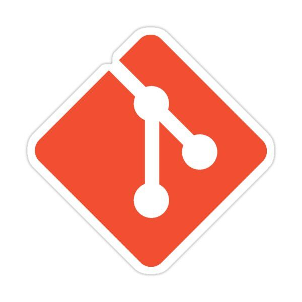

##  &nbsp; about me
 &nbsp; information systems and technologies @ belgorod state university 
 &nbsp; junior java backend developer
 &nbsp; constantly developing some pet-projects to stay competent and develop my skills
 &nbsp; finalist of the "roboschool" competition from the ITMO university and Sberbank.
 &nbsp; actively learning english (current cefr level is c1), preparing for the toefl exam

##  &nbsp; tech stack

 &nbsp; languages: java, c#, sql, c++, python, php 
 &nbsp; frameworks and libs: spring boot, spring data, spring security, hibernate, junit, mockito, apache poi, mapstruct  
 &nbsp; databases: postgresql, mysql. liquibase  
 &nbsp; instruments: maven, gradle, git, postman, docker 
 &nbsp; architecture: microservices, rest api, mvc, module testing 

##  &nbsp; my projects

- [pharmacy-spring](https://github.com/un4va1lablxx/pharmacy-spring) – app for a pharmacy store written on spring boot, includes authorisation, uses roles model, has some advanced filtering strategies and integrates an interactive map made by yandex-maps
- [courier-delivery](https://github.com/un4va1lablxx/courier_delivery) – my first spring boot app for a courier delivery written on spring boot, uses postgresql for data
- [uni-schedule](https://github.com/un4va1lablxx/uni_schedule) – app for the university schedule, was bored and made up ITMO university schedule website.
- [export-organization](https://github.com/un4va1lablxx/export-organization) & [export-user](https://github.com/un4va1lablxx/export-user) – microservices for an hr-platform (e-commerce developing for **LLC Reliable Techonologies**), together representing an export module which exports data from db to various formats of files (such as pdf, excel, etc...). used "mapstruct" lib for mapping existing entities into dto objects and "apache poi" for export in excel-format. also was applied migrations through liquibase and services were fully covered with unit-tests. 
